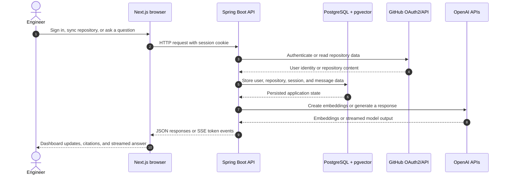
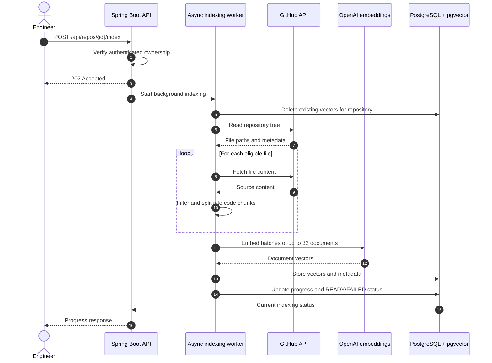
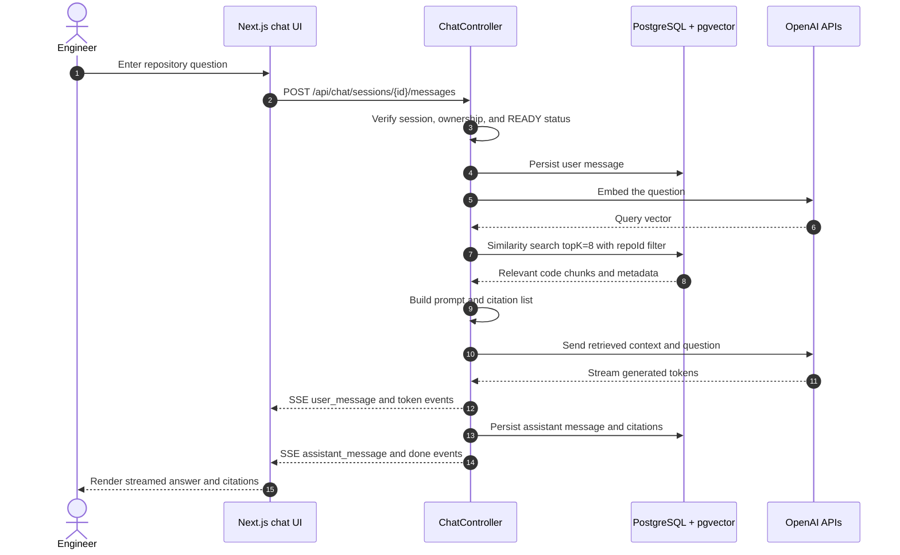

# AutoDev

AutoDev is a full-stack, repository-scoped retrieval-augmented generation (RAG) application for asking technical questions about GitHub repositories. An authenticated user signs in with GitHub, synchronizes repositories they own, indexes eligible source files into PostgreSQL with `pgvector`, and chats with an OpenAI-backed assistant that streams answers with repository citations.

The repository contains:

- `client/`: Next.js 16 / React 19 browser application
- `server/`: Spring Boot 4 / Java 21 API and indexing worker
- `docker-compose.yaml`: local PostgreSQL 16 + `pgvector` infrastructure

## Project overview

### Purpose and scope

AutoDev addresses repository comprehension and code-navigation use cases where a user needs answers grounded in a selected codebase rather than in a generic language-model prompt. The system:

1. Authenticates users through GitHub OAuth2.
2. Synchronizes repositories available to the authenticated GitHub account.
3. Filters and downloads supported repository files.
4. Splits files into embedding documents and stores them in a repository-scoped vector index.
5. Creates persistent chat sessions per repository.
6. Retrieves the most relevant code chunks for each question.
7. Streams an OpenAI response over Server-Sent Events (SSE).
8. Persists messages and citation metadata for later viewing.

The current implementation is intentionally repository-scoped and does not provide organization-wide search, arbitrary file uploads, code execution, autonomous code changes, or a multi-tenant hosted deployment.

### Target use cases

- Understand an unfamiliar repository without manually searching every file.
- Ask implementation, configuration, or dependency questions about a repository the user owns.
- Review answers with file-level citations.
- Keep multiple chat threads associated with one repository.
- Re-index a repository after its source has changed.

### Technology stack

| Layer | Technology |
| --- | --- |
| Browser UI | Next.js 16.3.4, React 19.2.8, TypeScript 5 |
| UI and data fetching | Tailwind CSS 4, shadcn components, TanStack React Query 5 |
| API | Spring Boot 4.1.1, Java 21, Spring Web MVC |
| Authentication | Spring Security OAuth2 Client, GitHub OAuth2, HTTP session cookie |
| Persistence | Spring Data JPA, PostgreSQL 16 |
| Vector retrieval | Spring AI 2.0.1, `pgvector`, HNSW, cosine distance |
| Models | OpenAI `gpt-4o-mini`, `text-embedding-3-small` |
| Local infrastructure | Docker Compose, `pgvector/pgvector:pg16` |

## Architecture

### System architecture



**Architectural annotations**

- **Repository isolation:** every repository and chat operation performs an ownership check; vector retrieval applies a `repoId` metadata filter. This prevents a user's question from retrieving chunks from another indexed repository.
- **Asynchronous indexing:** `IndexingService.indexAsync` runs on a dedicated executor so GitHub traversal and embedding work do not block the HTTP request that starts indexing.
- **Single operational data store:** relational application state and vector documents are hosted in PostgreSQL. This keeps local setup and consistency boundaries small while the project is in its current scope.
- **SSE over Web MVC:** the backend uses Spring MVC `SseEmitter` to forward model tokens to the browser while retaining a conventional MVC API for authentication, repositories, and chat history.
- **External boundaries:** GitHub supplies identity and source content; OpenAI supplies embeddings and generated responses. API keys and OAuth secrets are supplied through environment variables.

### Repository indexing flow



### RAG chat flow



## Performance and results

### Verified implementation metrics

The repository provides verified configuration and source-level metrics, but it does not contain a committed load-test harness or retrieval-evaluation dataset. The following values are therefore implementation facts, not claims of production performance.

| Metric | Verified value | Evidence |
| --- | ---: | --- |
| Indexing executor core threads | 2 | `server/.../config/AppConfig.java` |
| Indexing executor maximum threads | 4 | `server/.../config/AppConfig.java` |
| Indexing executor queue capacity | 50 | `server/.../config/AppConfig.java` |
| Embedding batch threshold | 32 documents | `IndexingService.VECTOR_BATCH_SIZE` |
| Progress update cadence | Every 5 files and the final file | `IndexingService.PROGRESS_EVERY_N_FILES` |
| Maximum indexed file size | 102,400 bytes | `app.indexing.max-file-bytes` |
| Configured chunk size | 800 characters | `app.indexing.chunk-size` |
| Chunking configuration | 800-character target converted to a token splitter size; `app.indexing.chunk-overlap=100` is present but is not currently passed to the splitter | `CodeChunker.java`, `application.properties` |
| Retrieval top-k | 8 documents | `RagSettings.TOP_K_CHUNKS` |
| SSE stream timeout | 180,000 ms | `RagSettings.STREAM_TIMEOUT_MS` |
| Embedding dimensions | 1,536 | `spring.ai.vectorstore.pgvector.dimensions` |
| Vector index | HNSW | `spring.ai.vectorstore.pgvector.index-type` |
| Vector distance | Cosine distance | `spring.ai.vectorstore.pgvector.distance-type` |
| GitHub pacing delay | 50 ms between indexing API calls | `app.github.api-delay-ms` |
| Session timeout | 7 days | `server.servlet.session.timeout` |
| Docker healthcheck interval | 5 seconds | `docker-compose.yaml` |
| Docker healthcheck timeout | 5 seconds | `docker-compose.yaml` |
| Docker healthcheck retries | 5 | `docker-compose.yaml` |

### Benchmark status

No verified numerical results are currently available in this repository for:

- throughput in requests/second, files/second, or chunks/second;
- p50, p95, or p99 indexing and chat latency;
- time to first token;
- runtime error rate under a defined workload;
- CPU, memory, database connection-pool, or container utilization.

These fields are marked **not measured** rather than estimated. A future benchmark should record the workload, repository size, model versions, database configuration, concurrency, warm/cold state, and measurement date alongside the results.

## RAG implementation and evaluation

### Retrieval design

The implemented pipeline uses:

- `text-embedding-3-small` embeddings with 1,536 dimensions;
- supported-language and path filtering before indexing;
- an 800-character configured chunk target;
- a token-based splitter; the current implementation does not apply the configured overlap property;
- file-path, language, repository ID, and chunk-index metadata;
- HNSW cosine similarity search;
- `topK = 8`;
- a mandatory `repoId` metadata filter;
- citations mapped from retrieved documents;
- a prompt containing retrieved context and the original question.

### Retrieval accuracy status

The project does not include a labeled question/document evaluation set, baseline retriever, or evaluation script. Consequently, the following required quality metrics have **no verified values**:

| Metric | Baseline | Post-optimization | Status |
| --- | ---: | ---: | --- |
| Retrieval accuracy | Not measured | Not measured | No labeled evaluation set |
| Context relevance score | Not measured | Not measured | No scoring harness |
| Hit rate@k | Not measured | Not measured | No ground-truth targets |
| Mean reciprocal rank (MRR) | Not measured | Not measured | No ground-truth targets |

The implementation contains retrieval-quality controls, including repository filtering and metadata-rich chunks, but those design changes must not be presented as measured accuracy improvements. Adding a reproducible evaluation set and recording before/after runs is required before publishing numerical RAG gains.

## Installation

### Prerequisites

- Java 21
- Node.js 20 or newer
- Docker Desktop with Docker Compose
- A GitHub OAuth application
- An OpenAI API key

### Environment configuration

Create a root `.env` file. At minimum, configure:

```dotenv
POSTGRES_PASSWORD=change-me
DB_URL=jdbc:postgresql://localhost:5433/autodev
DB_USERNAME=autodev_user
DB_PASSWORD=change-me
OPENAI_API_KEY=your-openai-key
GITHUB_CLIENT_ID=your-github-client-id
GITHUB_CLIENT_SECRET=your-github-client-secret
TOKEN_ENCRYPTOR_PASSWORD=change-me
TOKEN_ENCRYPTOR_SALT=change-me
CORS_ALLOWED_ORIGINS=http://localhost:3000
FRONTEND_URL=http://localhost:3000
```

Create `client/.env.local`:

```dotenv
NEXT_PUBLIC_API_BASE_URL=http://localhost:8080
```

Register the GitHub OAuth callback URL used by the backend, normally:

```text
http://localhost:8080/login/oauth2/code/github
```

### Start the database

```bash
docker compose up -d
```

The database is exposed on host port `5433` and uses the `autodev_pg_data` Docker volume.

### Start the backend

```bash
cd server
mvnw.cmd spring-boot:run
```

### Start the frontend

```bash
cd client
npm install
npm run dev
```

Open `http://localhost:3000`.

## Usage

1. Select **Sign in with GitHub**.
2. Synchronize repositories from the dashboard.
3. Start indexing a repository.
4. Wait for its status to become `READY`.
5. Open the repository chat.
6. Create a chat session and ask a question.
7. Review the streamed answer and its file citations.

The repository must finish indexing before a chat session can be created. Re-indexing replaces the existing vectors for that repository.

## API surface

| Method | Endpoint | Purpose |
| --- | --- | --- |
| `GET` | `/api/auth/login-url` | Return the GitHub login path |
| `GET` | `/api/auth/me` | Return the authenticated user |
| `GET` | `/api/repos` | Synchronize or list owned repositories |
| `GET` | `/api/repos/{id}` | Read one owned repository |
| `POST` | `/api/repos/{id}/index` | Start asynchronous indexing |
| `GET` | `/api/repos/{id}/status` | Read indexing status |
| `POST` | `/api/chat/sessions` | Create a session for a ready repository |
| `GET` | `/api/chat/sessions?repositoryId={id}` | List repository sessions |
| `GET` | `/api/chat/sessions/{id}` | Read session messages |
| `POST` | `/api/chat/sessions/{id}/messages` | Stream a RAG response over SSE |

## Contributing

1. Keep authentication and per-request ownership checks intact.
2. Preserve the `repoId` vector metadata filter.
3. Do not commit secrets or local environment files.
4. Update this README and `decisions.md` when architecture or operational behavior changes.
5. Do not claim performance or RAG-quality improvements without reproducible measurements.
6. Run the existing project checks before submitting a change:

```bash
cd client
npm run lint
npx tsc --noEmit

cd ..\server
mvnw.cmd test
```